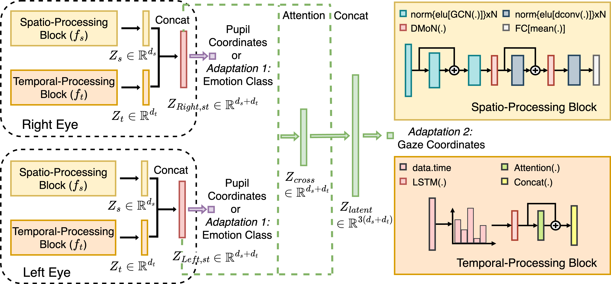
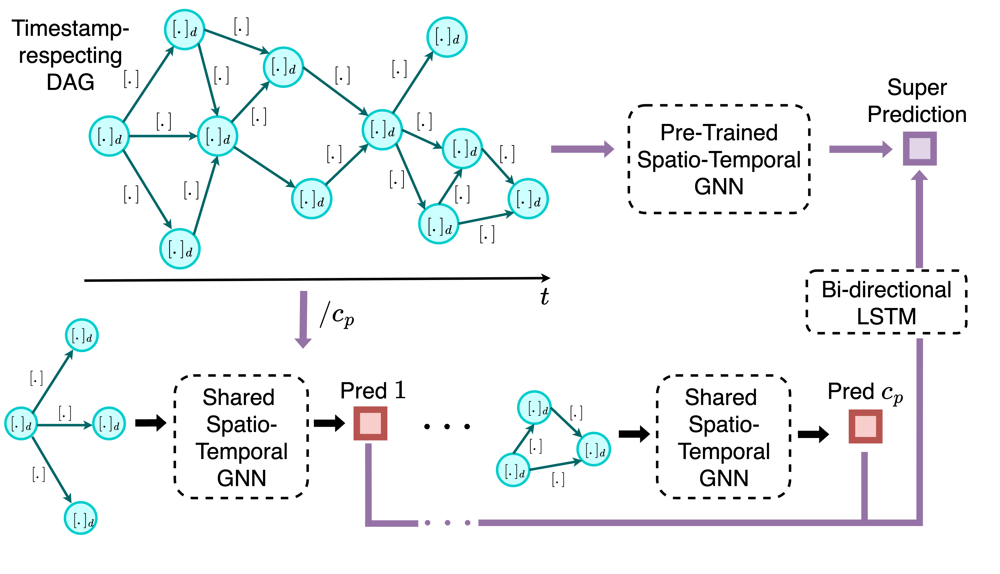

# SaccadeX: Directed Acyclic Graph-based Semi-Supervised Learning of Continuous Ocular Dynamics from Sparse Neuromorphic Streams

[Project Page](https://eye-tracking-for-physiological-sensing.github.io/SaccadeX/) | [Paper](https://openaccess.thecvf.com/content/WACV2026/papers/Bandara_SaccadeX_Directed_Acyclic_Graph-based_Semi-Supervised_Learning_of_Continuous_Ocular_Dynamics_WACV_2026_paper.pdf) | [Supplemental](https://openaccess.thecvf.com/content/WACV2026/supplemental/Bandara_SaccadeX_Directed_Acyclic_WACV_2026_supplemental.pdf)

## Abstract

Continuous eye tracking is critical for applications in human-computer interaction, including biometric authentication, gaze-based systems, and affective-cognitive modelling. Recent interest in neuromorphic event cameras has grown due to their sub-microsecond latency in capturing eye movement dynamics. However, existing event-based eye-tracking methods face challenges such as limited labels, sub-optimal event accumulation, and a lack of frameworks that fail to capture fine-grained temporal relationships within event volumes. To address these, we propose a directed acyclic graph-based semi-supervised approach with a framework that is adaptable across multiple closely related tasks, including gaze tracking, pupil tracking, and eye-based emotion recognition. Our approach enables efficient spatiotemporal learning with 95.5% parameter reduction compared to existing methods, achieving significant performance improvements: 38.75% improvement in pupil tracking accuracy, 68% and 63% reductions in gaze angle error on EV-Eye and EBV-Eye datasets, respectively, and 3.3% improvement in emotion recognition across all evaluated datasets.

## Overview

<br />
<br />

## Citation

If you find our work useful and/or use it in your research work, including the methods and this repository, please consider giving a star ⭐ and citing our paper.
```bibtex
@InProceedings{Bandara_2026_WACV,
    author    = {Bandara, Nuwan and Kandappu, Thivya and Misra, Archan},
    title     = {SaccadeX: Directed Acyclic Graph-based Semi-Supervised Learning of Continuous Ocular Dynamics from Sparse Neuromorphic Streams},
    booktitle = {Proceedings of the IEEE/CVF Winter Conference on Applications of Computer Vision (WACV)},
    month     = {March},
    year      = {2026},
    pages     = {1384-1394}
}
```

Please contact Nuwan at pmnsribandara@gmail.com if you have any issues concerning this work. 
